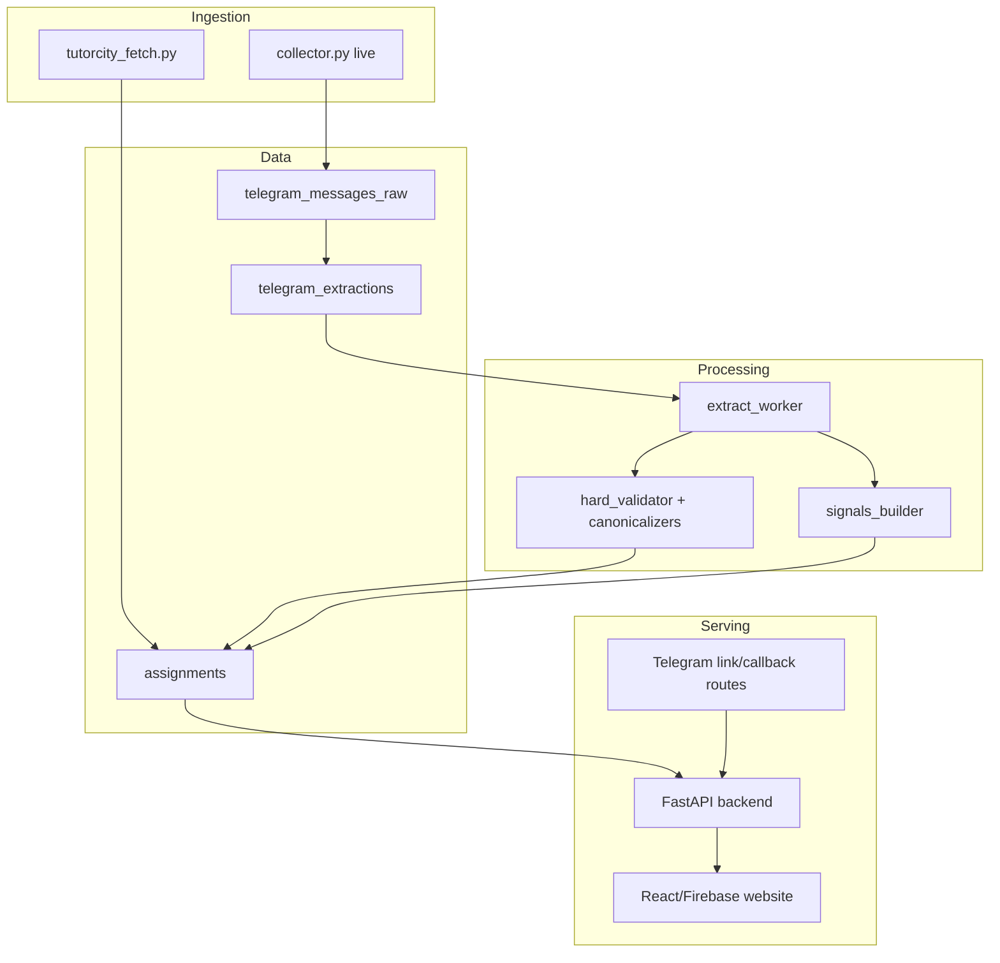

# TutorDex Architecture

<!-- doc_lint:enforce -->
Doc type: Explanation

**Docs metadata:**
**Status:** active
**Owner:** Mochi
**Last reviewed:** 2026-06-20
**Review trigger:** Update when data ownership, runtime boundaries, component ownership, failure modes, diagrams, or architecture decisions change.

Design boundaries and ownership notes for TutorDex. For quick navigation, read `SYSTEM_MAP.md`. For must-not-break assumptions, read `KNOWN_INVARIANTS.md`. For detailed system behavior, read `SYSTEM_INTERNAL.md`.

## System Shape

TutorDex is a monorepo with three main application surfaces:

- `TutorDexAggregator` owns assignment ingestion, extraction, persistence, and optional Telegram delivery side effects.
- `TutorDexBackend` owns HTTP APIs, matching, authentication integration, analytics/click tracking, and Telegram linking/callback routes.
- `TutorDexWebsite` owns the tutor-facing web UI and Firebase Auth client flow.

Shared contracts and taxonomy live in `shared/`. Observability configuration lives in `observability/`. Operational entry points live in `scripts/ops/`.

## Architecture Diagram

## Core Invariants

- `public.telegram_messages_raw` is the raw log. Preserve raw message fidelity.
- `public.telegram_extractions` is a replayable queue keyed by raw row and pipeline version.
- `public.assignments` is a materialized projection for API/website consumption, not the raw source of truth.
- `EXTRACTION_PIPELINE_VERSION` isolates reprocessing runs; bump it when prompt/schema/model changes require a clean extraction lane.
- `EXTRACTION_MATERIALIZE_ASSIGNMENTS=0` provides an analysis-only replay lane: extraction output is recorded without changing `public.assignments`.
- Deterministic extractors and validators should fail closed rather than invent values.
- Telegram broadcast and DM delivery are side effects; manual reprocessing should disable them unless explicitly intended.
- Runtime evidence must name the surface checked. Local Docker/WSL health is not BizServer/public production proof.
- Production extraction has a host-side LLM dependency on BizServer; prove both the Windows host endpoint and worker-container route before declaring LLM extraction healthy.
- Secrets live in env/config stores, never in docs, logs, commits, or verification snippets.

## Data Ownership

Aggregator-owned:

- Telegram collection and catchup.
- Raw message persistence.
- Extraction queue enqueueing and worker processing.
- LLM prompt/schema execution.
- Deterministic hardening: subjects, tutor types, time availability, postal fallback, status detection, duplicate/bump helpers.
- Assignment materialization into Supabase.
- Optional broadcast/DM delivery.

Backend-owned:

- Public and authenticated API routes.
- Matching and tutor preference access.
- Firebase token verification.
- Redis-backed live/linking state.
- Analytics and click tracking.
- Telegram webhook callback handling.

Website-owned:

- Assignment browsing UI.
- Tutor preference/profile UI.
- Firebase client auth.
- Frontend filtering/sorting/display behavior.

Shared-owned:

- Cross-component contracts.
- Taxonomy and canonicalization helpers used by multiple services.
- Shared config and observability primitives.

## Runtime Boundaries

Docker Compose runs the application stack and observability stack. Production/staging commands should go through `scripts/ops/*` so environment selection, compose project names, and confirmation gates stay consistent.

Common service boundaries:

- `collector-tail`: runs `python collector.py live`.
- `aggregator-worker`: runs `python workers/extract_worker.py`.
- BizServer host LLM: `TutorDexLlamaServer` runs llama.cpp outside Docker on port `1234`; workers reach it via `host.docker.internal`.
- `backend`: runs FastAPI.
- `telegram-link-bot`: handles link-code polling where enabled.
- `redis`: stores matching/linking/cooldown state.
- observability services: Prometheus, Alertmanager, Grafana, Tempo/OTEL, cAdvisor, node exporter, blackbox exporter.

## Failure Modes To Respect

- A healthy local compose project can mask a broken BizServer or public ingress path.
- Telegram session collisions can block collection/catchup while the rest of the stack looks healthy.
- Queue backlog can mean worker failure, pipeline-version mismatch, Supabase/RPC failure, LLM failure, or intentionally paused processing.
- LLM failures can be in-container worker issues or host-side `TutorDexLlamaServer`/llama.cpp issues; keep those surfaces separate.
- Polled sources can update `last_seen` without representing a newly published assignment.
- Broadcast/DM side effects can make reprocessing user-visible if not disabled.
- Env/log inspection can leak secrets if pasted raw.

## Change Boundaries

When changing extraction:

- Update prompt/schema code and examples together.
- Keep deterministic validators/canonicalizers in sync.
- Update persistence expectations and tests.
- Consider pipeline versioning and reprocessing plan.
- Update `SYSTEM_INTERNAL.md`.

When changing persistence or DB shape:

- Add migrations and rollback notes.
- Update shared contracts and API expectations.
- Verify Supabase/PostgREST/RPC paths.
- Update `SYSTEM_INTERNAL.md` and relevant feature docs.

When changing operations or deployment:

- Prefer `scripts/ops/*`.
- Update `OPERATIONS.md`.
- Update this architecture doc if ownership or runtime boundaries changed.
- Record verification evidence with surface labels.
- If the decision is durable, add or update an ADR under `docs/adr/`.

When changing frontend behavior:

- Keep Firebase/Auth/API assumptions explicit.
- Verify responsive UI where applicable.
- Update frontend README or feature docs if user-visible behavior changes.

## Documentation Boundaries

- Use `SYSTEM_MAP.md` for navigation and debug entry points.
- Use `ARCHITECTURE.md` for boundaries, invariants, and failure modes.
- Use `KNOWN_INVARIANTS.md` for explicit must-not-break assumptions.
- Use `DEPLOYMENT_TOPOLOGY.md` for runtime/deploy surfaces.
- Use `TESTING.md` for proof gates.
- Use `SYSTEM_INTERNAL.md` for detailed pipeline behavior and implementation reality.
- Use `OPERATIONS.md` for operator procedures.
- Use `DOCS_CHANGE_POLICY.md` for changed-path docs routing.
- Use `docs/adr/` for repo-local decisions.
- Use component READMEs for local setup and commands.
- Keep historical reports in archives unless they remain active references.
