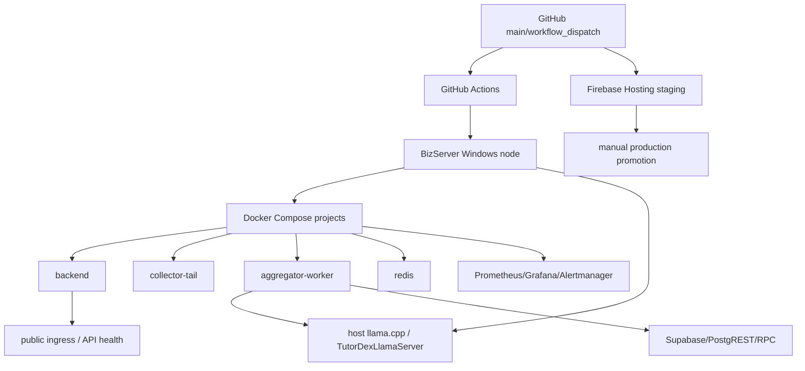

# TutorDex Deployment Topology

<!-- doc_lint:enforce -->
Doc type: Reference

**Docs metadata:**
**Status:** active
**Owner:** Mochi
**Last reviewed:** 2026-06-20
**Review trigger:** Update when deployment workflows, runtime hosts, compose services, public ingress, Firebase release behavior, or rollback procedures change.

Runtime and deployment surfaces for TutorDex. This document is about where things run and how to prove which surface you checked.

## Source Of Truth

- Backend/stack deployment workflow: `.github/workflows/deploy.yml`
- Firebase Hosting workflow: `.github/workflows/firebase-hosting.yml`
- Release policy: `DEPLOYMENT_RELEASE_FLOW.md`
- Ops commands: `../scripts/ops/`
- Surface-aware orientation: `../scripts/tutordex_healthcheck.sh`

## Main Surfaces

Local/WSL:

- Developer shell and repo checkout.
- Useful for docs, static checks, local tests, and local Docker checks.
- Not production proof.

Docker Desktop / compose:

- Root `docker-compose.yml` defines the application and observability stack.
- Compose project names are environment-specific through `scripts/ops/*`.
- `tutordex-staging` and `tutordex-prod` must be treated as separate surfaces.

BizServer Windows node:

- Production server surface reached by GitHub Actions through Tailscale SSH.
- Workflow path pulls under `D:/TutorDex` and runs `docker compose up -d --build --pull=never`.
- Evidence from WSL localhost is not evidence from BizServer.
- Host-side LLM dependency for production extraction: Windows scheduled task `TutorDexLlamaServer` runs `D:\TutorDex\TutorDexAggregator\start_llama_server_loop.bat` as `SYSTEM` at system startup. It serves llama.cpp on `0.0.0.0:1234`; worker containers reach it at `http://host.docker.internal:1234`.

Public ingress/API:

- User-facing backend/API health must be checked through the intended public URL or ingress path.
- A container or localhost health check is not enough for user-facing availability.
- Current prod Caddy ingress terminates `tutordex-api.duckdns.org` and proxies to the Docker service alias `backend:8000`.
- Prod blackbox monitoring uses a LAN-SNI route: it probes `https://192.168.1.42/...` while sending Host/SNI `tutordex-api.duckdns.org`, then relabels the `instance` back to the public URL. This proves Caddy/TLS/backend from inside the LAN, not outside-WAN reachability.
- Do not treat a failed DuckDNS curl from WSL/LAN as definitive public outage proof; that path can fail because of router hairpin/NAT loopback. Use an outside-LAN probe for true WAN availability.

Firebase Hosting:

- Staging target deploys automatically on `main` push.
- Production target deploys only through manual `workflow_dispatch`.
- Do not describe Firebase Hosting production as automatic from `main`.

Supabase/PostgREST/RPC:

- Database and queue health must be checked through the intended Supabase/PostgREST/RPC surface.
- Do not paste service role keys or raw env values while checking.

## Service Topology



Application services:

- `collector-tail` - Telegram live tail plus bounded catchup.
- `aggregator-worker` - extraction queue worker.
- `backend` - FastAPI API.
- `telegram-link-bot` - Telegram link-code polling where enabled.
- `redis` - matching/linking/cooldown/cache state.
- `tutorcity-fetch` - TutorCity polling.
- `freshness-tiers` - freshness tier updates.

Observability services:

- `prometheus`
- `alertmanager`
- `alertmanager-telegram`
- `grafana`
- `cadvisor`
- `node-exporter`
- `blackbox-exporter`
- `tempo`
- `otel-collector`

Logs are primarily container stdout unless a log backend is configured and verified.

## Normal Deployment Flow

Backend/compose stack:

1. Push or merge to `main`.
2. `.github/workflows/deploy.yml` connects through Tailscale SSH.
3. Server checkout under `D:/TutorDex` pulls latest code.
4. Docker Compose rebuilds/restarts with `--pull=never`.
5. Operator verifies the intended environment and public/API health.

Website:

1. Push or merge to `main`.
2. `.github/workflows/firebase-hosting.yml` deploys Firebase target `staging`.
3. Operator smoke tests staging against backend.
4. Operator manually runs `workflow_dispatch` for Firebase target `prod`.
5. Operator smoke tests production.

## Proof Requirements

For any deployment or incident report, include:

- surface checked
- command or workflow checked
- expected result
- observed result
- timestamp if relevant
- rollback path

Examples:

```bash
./scripts/tutordex_healthcheck.sh --env prod
./scripts/ops/status.sh --env prod
./scripts/ops/smoke.sh --env prod
```

If checking public availability, include the public URL or route checked without exposing tokens.

## Runtime Proof Matrix

| Surface | Proof command/check | Expected result | Caveat |
| --- | --- | --- | --- |
| Local WSL shell | `python3 scripts/docs_health.py` or `./scripts/tutordex_healthcheck.sh --skip-docker` | Docs/helper checks pass and surface is labeled local | Not production proof |
| Docker Desktop context | `./scripts/tutordex_healthcheck.sh --env staging` | Compose ps output for selected project | Depends on local Docker reachability |
| BizServer Windows node | GitHub Actions deploy log or explicit node-host status command | Correct checkout and compose project on server | Requires node/credential access |
| BizServer host LLM | `schtasks /Query /TN TutorDexLlamaServer /FO LIST /V` plus `http://127.0.0.1:1234/v1/models` | SYSTEM startup task enabled and llama.cpp endpoint returns model list | Startup-safe config is not the same as a real reboot test |
| Worker-to-host LLM | `docker exec tutordex-prod-aggregator-worker-1 ... host.docker.internal:1234/v1/models` | HTTP 200 from inside worker container | Proves container route only, not LLM extraction quality |
| Public ingress/API | `curl <public-url>/health` or healthcheck `--public-url` | HTTP success from public route | Does not prove worker queue health |
| LAN-SNI ingress monitor | `probe_success{job="blackbox_http_public",probe_route="lan_sni"}` in prod Prometheus | `1` for `/health` and `/health/dependencies` | Proves Caddy/TLS/backend from LAN only; not outside-WAN proof |
| Supabase/PostgREST/RPC | `scripts/ops/supabase_queue_health.sh --env <env>` | Queue/read checks succeed | Never paste service role keys |
| Firebase Hosting | Workflow or Firebase target inspection | Staging/prod target matches intended release | Production is manual dispatch |

## Rollback Paths

Compose/backend:

```bash
./scripts/ops/rollback.sh --env prod --to <git-ref> --yes
```

Firebase Hosting:

- Prefer GitHub Actions/Firebase release rollback through the Firebase console or documented Firebase CLI process.
- Record which Firebase target was rolled back.

Docs-only changes:

- Revert/restore the changed doc files.
- No runtime rollback required.

## Topology Caveats

- Do not assume Docker context `default` is the production Docker host.
- Do not assume `localhost` means the same thing from WSL, Windows, a container, or BizServer.
- Do not equate LAN-SNI blackbox success with outside-WAN success. If user-facing internet availability matters, verify from mobile data, an external runner, or another network.
- Do not use Supabase Studio UI as the primary agent access path; prefer documented scripts/RPCs.
- Do not run prod-changing commands without explicit prod intent, rollback, and verification evidence.
