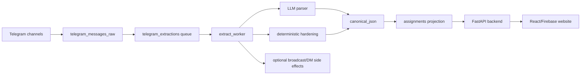

# TutorDex System Map

<!-- doc_lint:enforce -->
Doc type: Reference

**Docs metadata:**
**Status:** active
**Owner:** Mochi
**Last reviewed:** 2026-06-17
**Review trigger:** Update when repo components, primary flows, runtime surfaces, docs routing, or generated inventory change.

Skimmable navigation for agents and operators. For deeper design boundaries, read `docs/ARCHITECTURE.md`. For detailed behavior, read `docs/SYSTEM_INTERNAL.md`.

## Start Here

- Repo agent entry: `../AGENTS.md`
- Current operations: `OPERATIONS.md`
- Architecture boundaries: `ARCHITECTURE.md`
- Known invariants: `KNOWN_INVARIANTS.md`
- Deployment topology: `DEPLOYMENT_TOPOLOGY.md`
- Testing/proof gates: `TESTING.md`
- Detailed system behavior: `SYSTEM_INTERNAL.md`
- Docs routing: `DOCS_CHANGE_POLICY.md`
- Docs catalog: `DOCS_CATALOG.md`
- Generated inventory: `GENERATED_INVENTORY.md`
- ADR lane: `adr/README.md`
- Aggregator agent notes: `../TutorDexAggregator/AGENTS.md`

## What Exists

- `TutorDexAggregator/` - ingestion, extraction, persistence, Telegram broadcast/DM, catchup, deterministic hardening.
- `TutorDexBackend/` - FastAPI API, matching, auth integration, Redis/Supabase glue, analytics, Telegram callback/linking.
- `TutorDexWebsite/` - Vite/React/Firebase website for browsing assignments and managing tutor preferences.
- `shared/` - shared contracts, config, taxonomy, exceptions, and observability helpers.
- `observability/` - Prometheus, Grafana, Alertmanager, Tempo/OTEL, dashboards, and runbooks.
- `scripts/ops/` - canonical operational helpers for status, smoke, logs, deploy, restart, rollback, and Supabase ops.
- `docs/` - system docs, runbooks, feature docs, historical audits, and deployment notes.

## Primary Flows

Telegram assignment flow:

1. Telegram channels publish assignment posts.
2. `TutorDexAggregator/collector.py live` tails channels and runs bounded catchup.
3. Raw rows land in `public.telegram_messages_raw`.
4. Extraction jobs land in `public.telegram_extractions`.
5. `TutorDexAggregator/workers/extract_worker.py` claims jobs.
6. LLM parsing plus deterministic hardening produces canonical assignment payloads.
7. `TutorDexAggregator/supabase_persist.py` materializes rows into `public.assignments`.
8. `TutorDexBackend` serves website/API consumers and matching.
9. Optional Telegram broadcast/DM side effects run when configured.

TutorCity flow:

1. `TutorDexAggregator/utilities/tutorcity_fetch.py` polls TutorCity.
2. Rows bypass Telegram raw tables.
3. Persistence and optional distribution reuse the same assignment materialization paths.

Website/API flow:

1. `TutorDexWebsite` authenticates users with Firebase Auth.
2. Website calls `TutorDexBackend` endpoints.
3. Backend reads assignments from Supabase and tutor preference/linking state from Redis/Supabase.

Observability flow:

1. Services emit metrics/logs/traces.
2. Prometheus and Grafana expose metrics/dashboards.
3. Alertmanager routes alerts.
4. Container stdout remains the default log source unless a log backend is added.

## Flow Diagram



## Runtime Surfaces

Keep these separate when proving health:

- local WSL shell
- BizServer Windows node
- Docker Desktop context
- compose project/env (`tutordex-staging` or `tutordex-prod`)
- in-container command
- public ingress/API URL
- Supabase/PostgREST/RPC surface

Do not treat one surface as proof for another.

## Debug Entry Points

Orientation:

```bash
./scripts/tutordex_healthcheck.sh
./scripts/tutordex_healthcheck.sh --env staging
./scripts/tutordex_healthcheck.sh --env prod
```

Ops:

```bash
./scripts/ops/status.sh --env staging
./scripts/ops/status.sh --env prod
./scripts/ops/logs.sh --env prod aggregator-worker --since=30m
./scripts/ops/smoke.sh --env staging
./scripts/ops/smoke.sh --env prod
```

Targeted docs:

- Collector/catchup: `recovery_catchup.md`
- Testing/proof gates: `TESTING.md`
- Known invariants: `KNOWN_INVARIANTS.md`
- Deployment topology: `DEPLOYMENT_TOPOLOGY.md`
- Deployment release flow: `DEPLOYMENT_RELEASE_FLOW.md`
- Telegram webhook: `TELEGRAM_WEBHOOK_SETUP.md`
- Signals: `signals.md`
- Time availability: `time_availability.md`
- Duplicate detection: `DUPLICATE_DETECTION_INDEX.md`
- Observability: `../observability/README.md`

## Canonical Docs Model

- `../AGENTS.md` is the short repo agent constitution.
- `SYSTEM_MAP.md` is this navigation map.
- `ARCHITECTURE.md` is the design/boundary document.
- `KNOWN_INVARIANTS.md` is the must-not-break assumptions list.
- `DEPLOYMENT_TOPOLOGY.md` is the runtime/deploy surface map.
- `TESTING.md` is the proof gate catalog.
- `SYSTEM_INTERNAL.md` is the deep behavior reference.
- `OPERATIONS.md` is the current operations runbook.
- `DOCS_CHANGE_POLICY.md` maps changed paths to docs updates or explicit skip evidence.
- `DOCS_CATALOG.md` classifies active, feature, and historical docs.
- `GENERATED_INVENTORY.md` is refreshed by `python3 scripts/docs_inventory.py --write`.
- `DOCS_SCORECARD.md` records the SOTA docs audit and residual gaps.
- `adr/README.md` owns TutorDex repo-local decisions.
- `scripts/docs_health.py` owns the local docs-health smoke.
- Component READMEs own narrow component commands and setup.
- Dated audits and archive docs are historical unless a current doc links to them as active.

## Update Rules

- If a component moves or a new runtime surface is added, update this map.
- If a design invariant or ownership boundary changes, update `ARCHITECTURE.md`.
- If a must-not-break assumption changes, update `KNOWN_INVARIANTS.md`.
- If deployment/runtime ownership changes, update `DEPLOYMENT_TOPOLOGY.md`.
- If tests or proof gates change, update `TESTING.md`.
- If extraction, persistence, distribution, or schema behavior changes, update `SYSTEM_INTERNAL.md`.
- If health checks, prod ops, recovery, or incident procedures change, update `OPERATIONS.md`.
